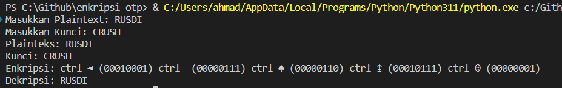
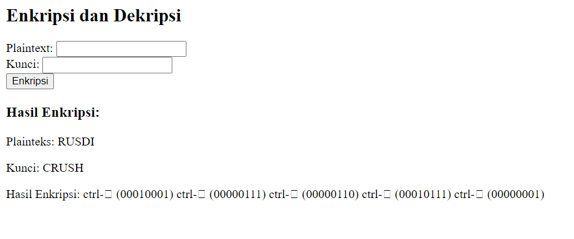

<body>
    <table border="1">
        <tr>
            <th> Nama</th>
            <th>NIM</th>
            <th>Kelas</th>
        </tr>
        <tr>
            <td>Ahmad Syukron</td>
            <td>312110056</td>
            <td>TI.21.A.1</td>
        </tr>
    </table>
</body>

# Kriptografi: Implementasi One Time Pad (OTP) di Python dan PHP
## Code Program
- Python
```python
def konversiascii(input_string):
    ascii_values = []
    for char in input_string:
        ascii_value = ord(char)
        ascii_values.append(ascii_value)
    return ascii_values

def xor_biner(biner1, biner2):
    result = int(biner1, 2) ^ int(biner2, 2)
    result_biner = bin(result)[2:].zfill(8)
    return result_biner

def biner_ke_desimal(biner):
    return int(biner, 2)

def kodeascii(ascii_code):
    return chr(ascii_code)

# Input Plaintext dan Kunci dari pengguna
plaintext = input("Masukkan Plaintext: ")
kunci = input("Masukkan Kunci: ")

# Konversi Plaintext ke ASCII
ascii_values_plaintext = konversiascii(plaintext)

# Konversi Kunci ke ASCII
ascii_values_kunci = konversiascii(kunci)

# XOR antara ASCII Plaintext dan ASCII Kunci
hasil_xor = [xor_biner(bin(ascii_values_plaintext[i])[2:], bin(ascii_values_kunci[i % len(kunci)])[2:]) for i in range(len(plaintext))]

# Konversi hasil XOR ke Desimal
hasil_desimal = [biner_ke_desimal(biner) for biner in hasil_xor]

# Konversi Desimal ke Karakter ASCII
hasil_karakter = [kodeascii(desimal) for desimal in hasil_desimal]

# Output Enkripsi
print("Plainteks:", plaintext)
print("Kunci:", kunci)

# Menampilkan hasil Enkripsi dalam format yang diminta
hasil_enkripsi = [f"ctrl-{chr(desimal)} ({hasil_xor[i]})" for i, desimal in enumerate(hasil_desimal)]
print("Enkripsi:", " ".join(hasil_enkripsi))

# Dekripsi
hasil_deskripsi = [xor_biner(bin(hasil_desimal[i])[2:], bin(ascii_values_kunci[i % len(kunci)])[2:]) for i in range(len(plaintext))]
hasil_deskripsi_karakter = [kodeascii(biner_ke_desimal(biner)) for biner in hasil_deskripsi]

# Output Dekripsi
print("Dekripsi:", "".join(hasil_deskripsi_karakter))

```
    + Hasil
    



# END
